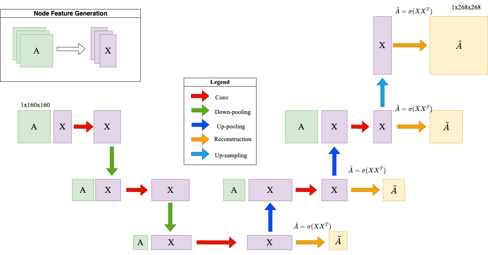

# DGL2024 Brain Graph Super-Resolution Challenge

## Contributors

Name of the team: The Chickens

Members: 
- Denis Fouchard
- Hippolyte Verninas
- Hugo Pham
- Sami Ribardière
- Yassine Benbihi

## Problem Description

Brain graph super-resolution aims to reconstruct high-resolution (HR) brain connectivity matrices from low-resolution (LR) inputs. High-resolution brain graphs provide detailed insights into neural connectivity but are expensive and difficult to obtain. In contrast, low-resolution data is more accessible but lacks fine-grained details.

This problem is crucial for neuroscience and clinical research. Super-resolution methods can enhance studies by predicting missing connections, improving disease classification, and enabling personalized treatments. Our goal is to develop a generative graph-based model that accurately reconstructs HR connectivity while preserving the brain’s structural organization.

## Name of your model - Methodology

Our model is a generative graph-based neural network designed for brain graph super-resolution. It learns to map low-resolution (LR) connectivity matrices to their high-resolution (HR) matrices while preserving structural integrity and modularity.

The model consists of three key components:
- a Graph Encoder that extracts latent representations from LR connectivity matrices using message passing and hierarchical pooling.
- a Super-Resolution Module that upscales the latent representation using graph-based interpolation and learnable transformation layers.
- a Graph Decoder that reconstructs the HR graph using expressive node aggregation and topology-aware refinement techniques.

We incorporate multi-scale learning, attention-based message passing, and regularization losses to ensure that the generated HR graphs retain biologically meaningful patterns.

## Model Architecture  

## Used External Libraries

To install all dependencies at once, run:

pip install -r requirements.txt

Our model relies on the following external libraries:

- PyTorch – Provides the deep learning framework for training and optimizing our model.
- PyTorch Geometric (PyG) – Enables efficient graph-based neural network computations.
- NetworkX – Used for graph data manipulation and preprocessing.
- SciPy – Supports numerical computations and sparse matrix operations

## Results

- Insert your bar plots.

## References

- H. Gao and S. Ji, “Graph u-nets,” in International Conference on Machine
Learning, 2019, pp. 2083–2092.
- M. Isallari and I. Rekik, “Graph super-resolution network for predicting
high-resolution connectomes from low-resolution connectomes,” in International Workshop on PRedictive Intelligence In MEdicine. Springer,
2020.
- ——, “Brain graph super-resolution using adversarial graph neural
network with application to functional brain connectivity,” 2021.
[Online]. Available: https://arxiv.org/abs/2105.00425
-  S. Yun, M. Jeong, R. Kim, J. Kang, and H. J. Kim, “Graph transformer
networks,” CoRR, vol. abs/1911.06455, 2019. [Online]. Available:
http://arxiv.org/abs/1911.06455
- K. Xu, W. Hu, J. Leskovec, and S. Jegelka, “How powerful are
graph neural networks?” CoRR, vol. abs/1810.00826, 2018. [Online].
Available: http://arxiv.org/abs/1810.00826
- V. P. Dwivedi and X. Bresson, “A generalization of transformer networks
to graphs,” AAAI Workshop on Deep Learning on Graphs: Methods and
Applications, 2021.